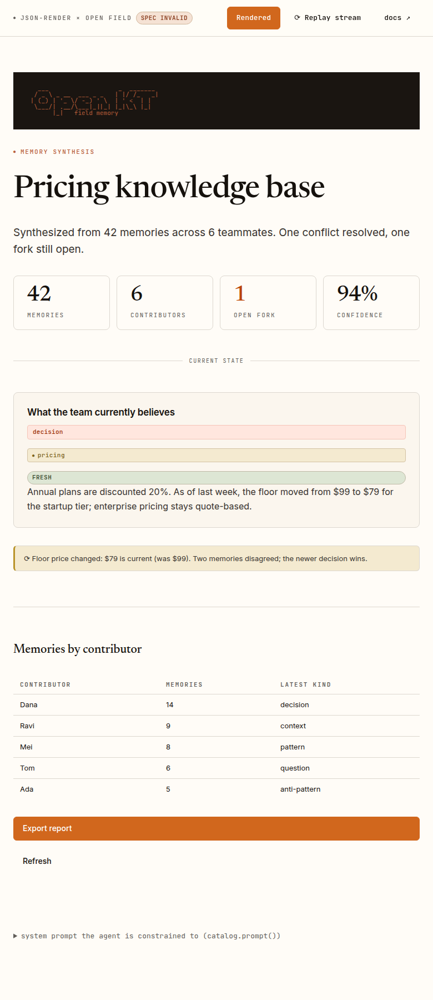

# json-render × Open Field — prototype

A working prototype that drives the [Open Field](../../claude-code/openkt-demos)
design system through [`json-render`](https://json-render.dev)
(`vercel-labs/json-render`). It validates json-render as the foundation of the
Deepwork **generative UI library for client agents**: an agent emits JSON
constrained to an Open Field component catalog, and it streams into branded,
on-design React UI.

→ **Recommendation memo:** [`RECOMMENDATION.md`](./RECOMMENDATION.md)
(includes the license + constraints report).



## What's here

| File | Role |
|------|------|
| `src/catalog.ts` | The **Open Field catalog** — every component an agent may emit, with Zod prop schemas. `catalog.prompt()` turns this into the system prompt the model is constrained to. |
| `src/registry.tsx` | The **registry** — maps each catalog component to Open Field markup (`openfield.css` classes only) + the action handlers. |
| `src/openfield.css` | Open Field design tokens + component layer, vendored from the openkt-demos plugin's `openkt-pages.css` (single source of truth: `masti-ai/openfield`). |
| `src/specs/memory-dashboard.ts` | An **agent-emitted spec** — the JSON a client agent would stream back. Hand-authored here to stand in for a live model call. |
| `src/spec-utils.ts` | `withDefaults()` — normalizes a streamed spec before validation (fills the `visible` field this json-render version requires). |
| `src/App.tsx` | Demo harness: renders the spec, validates it against the catalog (`spec valid` badge), and replays it element-by-element to mimic streaming. |

## The loop this proves

```
catalog.ts ──catalog.prompt()──▶ system prompt ──▶ [agent] ──▶ JSON spec
                                                                   │
                                       catalog.validate() ◀────────┤  (guardrail)
                                                                   ▼
                              <Renderer registry={Open Field}/> ──▶ branded UI
```

The agent can only emit catalog components, and props are Zod-validated — so
"the Open Field design language is not optional" stops being a convention and
becomes a data-layer guarantee.

## Run it

```bash
npm install
npm run dev        # http://localhost:5173 — live dev server
# or
npm run build      # tsc --noEmit + vite build → dist/
npm run preview
```

`npm run build` is the proof it compiles end to end (types + bundle).

## Swapping surfaces

The same `catalog.ts` + agent spec can render through a different registry —
`@json-render/react-native`, `@json-render/shadcn`, `@json-render/ink`
(terminal), etc. Only `registry.tsx` (the Open Field bindings) changes; the
catalog and the agent's output stay identical. That portability is the main
reason this is a strong foundation — see the memo.

## Notes / known edges

- This json-render version's React schema marks each element's `visible` field
  **required** for `catalog.validate()` (the `<Renderer>` itself tolerates its
  absence). `withDefaults()` fills it — the same repair step a real client runs
  on streamed output. See `RECOMMENDATION.md` → Constraints.
- Streaming here is *simulated* (progressive element reveal) so the prototype is
  self-contained. Production streaming uses `createSpecStreamCompiler` fed by the
  server transform (`createJsonRenderTransform` / `pipeJsonRender`); the render
  UX is identical.
- `.callout / .badge / .stat / table` classes were documented in the openkt-demos
  `components.md` but missing from the source CSS — filed as bead **op-xie**. The
  complete component layer added here (`openfield.css`) is the reference fix to
  upstream into `masti-ai/openfield` (epic internal tracker).
